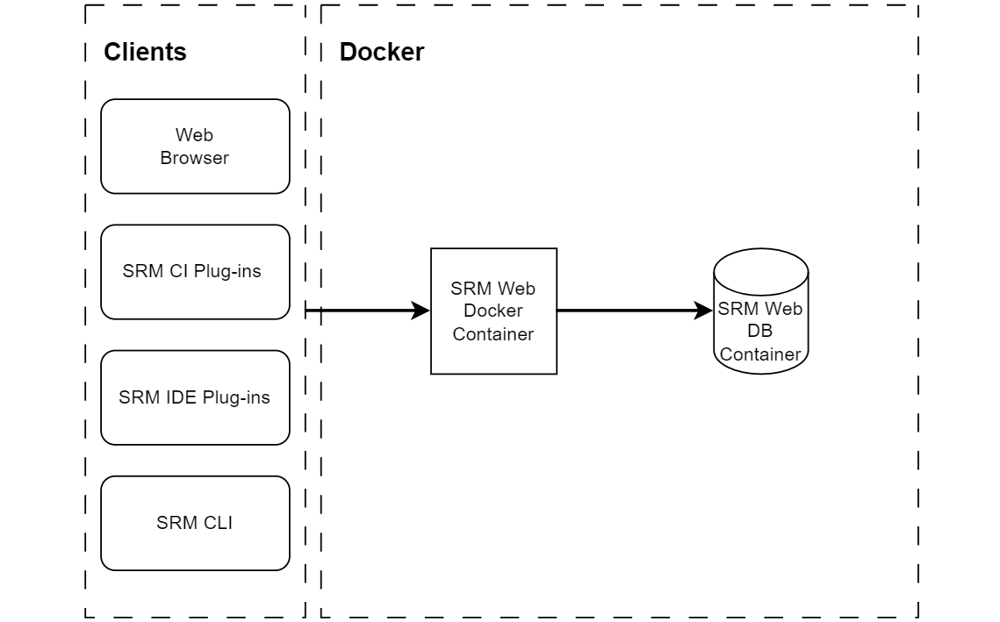
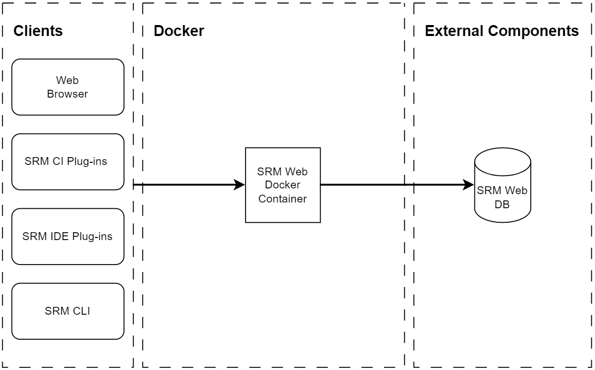

# Software Risk Manager Docker Compose Deployment

<!-- toc -->

- [Software Risk Manager Core Feature](#software-risk-manager-core-feature)
- [Requirements](#requirements)
  * [Docker Compose Requirements](#docker-compose-requirements)
  * [System Size](#system-size)
  * [Core Feature Requirements](#core-feature-requirements)
    + [Core Web Workload Requirements](#core-web-workload-requirements)
    + [Core Web Database Workload Requirements](#core-web-database-workload-requirements)
    + [Core Persistent Storage Requirements](#core-persistent-storage-requirements)
    + [Core Internet Access Requirements](#core-internet-access-requirements)
- [Pre-work](#pre-work)
  * [Persistent Storage Pre-work](#persistent-storage-pre-work)
  * [External Web Database Pre-work](#external-web-database-pre-work)
  * [Trust Certificates Pre-work](#trust-certificates-pre-work)
  * [HTTPS Pre-work](#https-pre-work)
- [Installation](#installation)
  * [Prerequisites](#prerequisites)
  * [Volume Naming](#volume-naming)
  * [Installation - No External Database](#installation---no-external-database)
  * [Installation - External Database](#installation---external-database)
- [Customizing Software Risk Manager](#customizing-software-risk-manager)
  * [Custom Props](#custom-props)
  * [Custom Context Path](#custom-context-path)
- [Backup and Restore](#backup-and-restore)
  * [Prerequisites](#prerequisites-1)
    + [Windows Prerequisites](#windows-prerequisites)
  * [Creating a Backup](#creating-a-backup)
    + [Backup - No External Database](#backup---no-external-database)
    + [Backup - External Database](#backup---external-database)
  * [Backup Retention](#backup-retention)
  * [Restoring a Backup](#restoring-a-backup)
- [Upgrading](#upgrading)
  * [Running Software Risk Manager After Upgrade](#running-software-risk-manager-after-upgrade)
- [Migrating from Software Risk Manager Installer to Docker Compose](#migrating-from-software-risk-manager-installer-to-docker-compose)
  * [Prerequisites](#prerequisites-2)
    + [Windows Prerequisites](#windows-prerequisites-1)
  * [Migration - No External Database](#migration---no-external-database)
- [Uninstall](#uninstall)

<!-- tocstop -->

# Software Risk Manager Core Feature

The footprint of your Software Risk Manager Docker Compose deployment depends on whether you plan to use an external database.

The Software Risk Manager web application requires a MariaDB (version 10.6.x) or a MySQL (version 8.0.x) database instance. You can provide a database instance or use what's included in the default Compose file. An external database can be a standalone instance or one managed on your behalf by a cloud provider like AWS or Azure. 

A deployment using an external database consists of one Software Risk Manager Docker container for the web application that depends on a Docker volume.



A deployment without an external database includes an additional Docker container for the SRM Web database instance. The MariaDB database instance stores data using a Docker volume.



# Requirements

Refer to what follows for the Software Risk Manager Docker Compose requirements.

## Docker Compose Requirements

The Software Risk Manager deployment requires Docker Compose version 2.

## System Size

Although we often get asked what the hardware requirements are, there is no one answer since it largely depends on how many Software Risk Manager projects will be active at the same time, how frequently analyses will be conducted, whether built-in tools are being used, the number of results from tools in use, how many concurrent users are expected to use the system, and what other system interactions might be configured. Taking that into account, you can use some general guidelines to determine the size of your deployment.

| Size | Total Projects | Daily Analyses | Concurrent Analyses |
|:-|-:|-:|-:|
|Small|1 - 100|1,000|8|
|Medium|100 - 2,000|2,000|16|
|Large|2,000 - 10,000|10,000|32|
|Extra Large|10,000+|10,000+|64|

## Core Feature Requirements

This section describes the web and web database requirements based on the system size.

### Core Web Workload Requirements

| Size | CPU Cores | Memory | IOPs | Storage |
|:-|-:|-:|-:|-:|
|Small|4|16 GB|3,000|64 GB|
|Medium|8|32 GB|6,000|128 GB|
|Large|16|64 GB|12,000|256 GB|
|Extra Large|32|128 GB|32,000|512 GB|

### Core Web Database Workload Requirements

| Size | CPU Cores | Memory | IOPs | Storage |
|:-|-:|-:|-:|-:|
|Small|4|16 GB|3,000|192 GB|
|Medium|8|32 GB|6,000|384 GB|
|Large|16|64 GB|12,000|768 GB|
|Extra Large|32|128 GB|32,000|1536 GB|

### Core Persistent Storage Requirements

The Software Risk Manager web workload requires a volume resource to store various files: the analysis inputs it receives, including the source code it displays on the Finding Details page, log files, and configuration files, to include data required to decrypt certain database records.

| Volume | Feature | Description |
|:-|:-:|:-:|
| Web AppData | Core | Required volume for web workload |
| DB Data | Core (when not using external database) | Database volume for database |

### Core Internet Access Requirements

Software Risk Manager uses internet access in the background for some activities, such as keeping tool data up-to-date and periodically checking for a new Software Risk Manager release.

Software Risk Manager does not require internet access; however, internet access is highly recommended to ensure full functionality.

To disable background internet access by Software Risk Manager, [customize your Software Risk Manager deployment](#custom-props) by setting `codedx.offline-mode = true`. The default is false. Note that this will not disable any internet access that may occur due to user action or configuration settings, such as Tool Connector, Git, or Issue Tracker configurations.

When internet access is enabled, Software Risk Manager will perform the following actions:

- Update notifications - Software Risk Manager will periodically check for newer versions and display an update notification when one is available. Requests for the latest version are sent to https://service.codedx.com/updates/latestVersionData.json.
- Dependency-Check updates - Dependency-Check will periodically download updates from the National Vulnerability Database, the Retire.js repository, or reach out to Maven Central while scanning Java dependencies (this aids in the dependency identification process, to cut down on both false positive and false negative results). 
- If Software Risk Manager is in offline mode, this may lead to lower quality results when running Dependency-Check as a bundled tool.
- Secure Code Warrior - Unless noted elsewhere, Software Risk Manager will reach out to any URLs belonging to the securecodewarrior.com domain.

# Pre-work

The following sections specify pre-work that might apply to your deployment. Pre-work tasks require updates to your Docker Compose file. If you are not using an external database, you will edit docker-compose.yml. If you are using an external database, you will edit docker-compose-external-db.yml instead.

## Persistent Storage Pre-work

Software Risk Manager depends on one or more Docker volumes. When using [selinux](https://docs.docker.com/storage/bind-mounts/#configure-the-selinux-label), you must append `:Z` to volumes listed in your Docker Compose file, including the default volumes and any extra volumes added during pre-work tasks.

## External Web Database Pre-work

Software Risk Manager includes a MariaDB database that requires no configuration on your part, so you can skip this section if you do not plan to use an external database instance.

If you prefer an external database, the web workload supports MariaDB version 10.6.x and MySQL version 8.0.x. Complete the following pre-work before installing Software Risk Manager with an external web database.

Your MariaDB/MySQL database must include the following variable configuration.

- optimizer_search_depth=0
- character_set_server=utf8mb4
- collation_server=utf8mb4_general_ci
- lower_case_table_names=1
- log_bin_trust_function_creators=1

The log_bin_trust_function_creators parameter is required when using replication (sometimes enabled by default).

If you are using a database instance hosted by AWS, Azure, or GCP, refer to [how to create a new AWS parameter group](https://docs.aws.amazon.com/AmazonRDS/latest/UserGuide/USER_WorkingWithParamGroups.html), [how to configure Azure Database for MySQL parameters](https://learn.microsoft.com/en-us/azure/mysql/single-server/how-to-server-parameters), or [how to configure GCP Cloud SQL MySQL database flags](https://cloud.google.com/sql/docs/mysql/flags).

Refer to the Web Database Workload Requirements section for database instance configuration details. You must pre-create the database catalog and the Software Risk Manager database user with the following steps. 

>Note: If you have to reinstall Software Risk Manager and delete your Software Risk Manager data, you must repeat Steps 2 and 3 after deleting your Software Risk Manager Docker volume.

1. Create a database user. You can customize the following statement to create a user named "srm," remove 'REQUIRE SSL' when not using TLS (your database instance may require security transport).

   CREATE USER 'srm'@'%' IDENTIFIED BY 'enter-a-password-here' REQUIRE SSL;

2. Create a database catalog. The following statement creates a catalog named srmdb.

   CREATE DATABASE srmdb;

3. Grant required privileges on the database catalog to the database user you created. The following statements grant permissions to the srm database user.

   GRANT SELECT, INSERT, UPDATE, DELETE, CREATE, CREATE TEMPORARY TABLES, ALTER, REFERENCES, INDEX, DROP, TRIGGER ON srmdb.* to 'srm'@'%';
   FLUSH PRIVILEGES;

4. If your database configuration requires Software Risk Manager to trust a certificate (e.g., the [Amazon RDS root certificate](https://s3.amazonaws.com/rds-downloads/rds-ca-2019-root.pem)), follow the [Trust Certificates](#trust-certificates) instructions to trust your database certificate and update the volumes section of your docker-compose-external-db.yml file.

## Trust Certificates Pre-work

Your Software Risk Manager instance can trust self-signed certificates or certificates issued by certificate authorities that are not trusted by default. Obtain a copy of the [cacerts](https://en.wikipedia.org/wiki/Java_KeyStore) file from a Java 11 distribution, which will include the [keytool](https://cr.openjdk.org/~jjg/8261930/docs/specs/man/keytool.html) program you will need for the following command:

```bash
keytool -import -trustcacerts -keystore ./cacerts -file /path/to/cert -alias cert-name
```

>Note: The default password for a Java cacerts file is `changeit`.

You can mount your cacerts file by adding a line to the volumes list in the codedx-tomcat section:

```yaml
    codedx-tomcat:
        ...
        volumes:
            - codedx-appdata:/opt/codedx
            - /path/to/cacerts:/opt/java/openjdk/lib/security/cacerts
        ...
```

>Note: Append `:Z` to the extra volume mount when using [selinux](https://docs.docker.com/storage/bind-mounts/#configure-the-selinux-label).

## HTTPS Pre-work

The Tomcat container can support HTTPS. For example, generate a self-signed certificate with `openssl` (or better yet, obtain a real certificate from a certificate authority):

```bash
openssl req -new -newkey rsa:4096 -days 3650 -nodes -x509 -subj "/C=US/ST=New York/L=Northport/O=Software Risk Manager/CN=localhost" -keyout ./ssl.key -out ./ssl.crt
```

The [server.xml](../server.xml) file contains a configuration that supports HTTPS using **[Tomcat's SSL/TLS capability](https://tomcat.apache.org/tomcat-9.0-doc/ssl-howto.html)**.

This template can be mounted over the existing `server.xml` in the Docker image. The SSL certificate and private key must also be mounted.

Update the codedx-tomcat section in your Docker Compose file (either `docker-compose.yml` or `docker-compose-external-db.yml`) with SSL and server.xml volume mounts, switching ports from 8080:8080 to 8443:8443. See what follows for Docker Compose file content using port 8443 with extra volume mounts for server.xml, ssl.key, and ssl.crt.

```yaml
    codedx-tomcat:
        ...
        volumes:
            - codedx-appdata:/opt/codedx
            - /path/to/ssl.crt:/usr/local/tomcat/conf/ssl.crt
            - /path/to/ssl.key:/usr/local/tomcat/conf/ssl.key
            - /path/to/server.xml:/usr/local/tomcat/conf/server.xml
        ports:
            - 8443:8443
        ...
```

>Note: Append `:Z` to the extra volume mount when using [selinux](https://docs.docker.com/storage/bind-mounts/#configure-the-selinux-label).

# Installation

This section details how to start a functional instance of Software Risk Manager using Docker Compose. Installation instructions will vary based on whether you are using an external database. Complete the required pre-work before continuing with either the no-external-database or external-database installation path.

## Prerequisites

1. Install Docker using **[these instructions](https://docs.docker.com/engine/installation/linux/docker-ce/ubuntu/#install-docker-ce-1)**.
2. Install **[docker-compose](https://docs.docker.com/compose/install/)**.

## Volume Naming

When creating named volumes Docker Compose will prepend the project name, which is the current directory name by default, to the volume name. Meaning if you have a Docker Compose install under the folder `srm-docker` and another under `srm-docker-2` their volume names will be distinct and contain different data. Without specifying the `-p` option the following two named volumes would exist:

- `srm-docker_codedx-appdata-volume`
- `srm-docker-2_codedx-appdata-volume`

Named volumes are created when doing `docker-compose up`, so if you want to override the default naming, specify a project name the first time you execute this command, like so:

```powershell
docker-compose -p srm -f ./docker-compose.yml up
```

## Installation - No External Database

You will use the docker-compose.yml file to install Software Risk Manager without an external database.

1. Select a password for the MariaDB root user, one that does not use single quote characters. Edit your `docker-compose.yml` file by specifying the password for both the MARIADB_ROOT_PASSWORD and DB_PASSWORD parameters.

2. Select a password for the Software Risk Manager admin user. Edit your `docker-compose.yml` file by specifying the password for the SUPERUSER_PASSWORD parameter.

3. Run `docker-compose -f ./docker-compose.yml up -d` to start the SRM Docker containers.

4. Run `docker-compose -f ./docker-compose.yml logs -f` to view log data. When the message "The Server is now ready!" appears in the console, you can navigate to either <http://hostname:8080/srm> or <https://hostname:8443/srm> (depending on your [HTTPS configuration](#https)) to log into your Software Risk Manager instance.

5. To stop, run `docker-compose -f ./docker-compose.yml stop`, and to remove the Docker containers automatically created, run `docker-compose -f ./docker-compose.yml down`.

>Note: If you want to migrate data from an existing Software Risk Manager system, refer to [these instructions](#migrating-from-software-risk-manager-installer-to-docker-compose).

## Installation - External Database

1. Select a password for the Software Risk Manager admin user. Edit your `docker-compose-external-db.yml` file by specifying the password for the SUPERUSER_PASSWORD parameter.

1. Edit the docker-compose-external-db.yml file by appending `&useSSL=true&requireSSL=true` to the DB_URL parameter.

2. Edit the docker-compose-external-db.yml file:

    a. Enter the database username for the DB_USER parameter

    b. Enter the database password for the DB_PASSWORD parameter

    e. Update the DB_URL parameter by specifying your database instance hostname

    f. Update the DB_URL parameter by specifying your Software Risk Manager database name (e.g., srmdb)

    Here is an example of a DB_URL parameter value using hostname `db-hostname` and database name `srmdb`:

    ```
    "jdbc:mysql://db-hostname/srmdb?sessionVariables=sql_mode='STRICT_TRANS_TABLES,ERROR_FOR_DIVISION_BY_ZERO,NO_ENGINE_SUBSTITUTION'"
    ```

    If you followed the steps required for secure transport, your connection string will look like this:

    ```
    "jdbc:mysql://db-hostname/srmdb?sessionVariables=sql_mode='STRICT_TRANS_TABLES,ERROR_FOR_DIVISION_BY_ZERO,NO_ENGINE_SUBSTITUTION'&useSSL=true&requireSSL=true"
    ```

3. Follow the [HTTPS](#https) instructions if your deployment requires TLS/SSL.

4. Start Software Risk Manager with the following command:

    ```
    docker-compose -f ./docker-compose-external-db.yml up -d
    ```

    You can run the following commands to view Software Risk Manager log data (assumes a codedx-docker_codedx-tomcat_1 container name):

    docker exec codedx-docker_codedx-tomcat_1 tail -f /opt/codedx/log-files/codedx.log

    docker logs codedx-docker_codedx-tomcat_1

>Note: If you want to migrate data from an existing Software Risk Manager system, refer to [these instructions](#migrating-from-software-risk-manager-installer-to-docker-compose).

# Customizing Software Risk Manager

You can change Software Risk Manager's behavior by specifying Software Risk Manager configuration properties.

## Custom Props

Software Risk Manager's features can be customized through the configuration file `codedx.props` which, by default, is located in your Tomcat container at `/opt/codedx`. A full list of configuration parameters and how to change them can be found at [Install Guide](https://sig-product-docs.synopsys.com/bundle/srm/page/install_guide/Installation/overview.html).

For example, to automatically sign a user out after 15 minutes of inactivity (20 minutes by default), set `session.lifetime` to `15 minutes`.

Here's how this can be done in a Docker Compose install:

1. With Software Risk Manager up and running, copy its codedx.props file to your current working directory using the following `docker cp` command, replacing the codedx-docker_codedx-tomcat_1 Docker container name as necessary (you can list running Docker containers with `docker ps`):

```
docker cp codedx-docker_codedx-tomcat_1:/opt/codedx/codedx.props .
```

2. Edit your local codedx.props by appending the following line:

```
session.lifetime = 15 minutes
```

3. Copy codedx.props back to its original location, replacing the codedx-docker_codedx-tomcat_1 Docker container name as necessary:

```
docker cp codedx.props codedx-docker_codedx-tomcat_1:/opt/codedx/codedx.props
```

4. Restart the SRM web container by running the Docker Compose `down` and `up` commands you use for your deployment.

## Custom Context Path

By default, Software Risk Manager is accessible at `/srm`. For backward compatibility, requests to `/codedx/api` and `/codedx/x` will be rewritten to `/srm/api` and `/srm/x` respectively, and requests to `/codedx` will be redirected to `/srm`.

You can change Software Risk Manager's context path by setting the SRM_WEBAPP_NAME environment variable in your Docker Compose file. The following example changes the default context path from `/srm` to `/mysrm`:

```
    codedx-tomcat:
        image: ...
        environment:
            DB_URL: ...
            SRM_WEBAPP_NAME: "mysrm"
```

With the above configuration, you can access Software Risk Manager at `hostname/mysrm` after restarting Software Risk Manager. URL rewrites and redirects from `/codedx` get disabled when using a custom context path.

# Backup and Restore

This section explains how to back up and restore Software Risk Manager using `backup.ps1` and `restore.ps1` in the `scripts` directory. Both scripts include a `-p` project name parameter that you should specify if you used a project name with your Docker Compose `up` command.

The backup script creates a new volume named codedx-backups where each backup gets stored by name. You can either sepcify a name or let the backup script generate a name for you with formatted as `backup-{date}-{time}`.

>Note: Be cautious of commands such as `docker volume prune`. The volume storing Software Risk Manager backups is not attached to a container and would be deleted.

## Prerequisites

The Software Risk Manager backup and restore scripts depend on [PowerShell Core](https://github.com/PowerShell/PowerShell#get-powershell), which can be installed on macOS, Linux, and Windows.

When running the backup and restore scripts, make sure you're either in a PowerShell Core terminal environment or the command begins with `pwsh` so it's run by PowerShell Core.

### Windows Prerequisites

Ensure you can run PowerShell Core scripts on Windows by switching your PowerShell Execution Policy to RemoteSigned (recommended) or Unrestricted. You must run the Set-ExecutionPolicy -ExecutionPolicy RemoteSigned command from an elevated/administrator Command Prompt.

## Creating a Backup

Backup instructions will vary based on whether you are using an external database. Use the following procedures to create a backup that will include the volume data for your deployment under the name `my-srm-backup`.

### Backup - No External Database

1. Stop your containers using the Docker Compose `down` command for your deployment.

```
docker-compose -f /path/to/your-docker-compose-file down
```

2. Open a terminal window and change directory to your srm-docker GitHub repository:

```
cd /path/to/srm-docker
```

3. Run the backup.ps1 script by specifying a backup name (e.g., my-srm-backup) and the path to your Docker Compose file:

```
pwsh ./scripts/backup.ps1 -BackupName my-srm-backup -ComposeConfigPath /path/to/your-docker-compose-file
```

>Note: Specify a project name using the `-p` parameter, if necessary.

4. Verify that you see this message indicating a successful backup:

```
Successfully created backup <backup-name>
```

### Backup - External Database

1. Stop your containers using the Docker Compose `down` command for your deployment.

```
docker-compose -f /path/to/your-docker-compose-file down
```

2. Open a terminal window and change directory to your srm-docker GitHub repository:

```
cd /path/to/srm-docker
```

3. Run the backup.ps1 script by specifying a backup name (e.g., my-srm-backup), the path to your Docker Compose file, and the name of your web volume (you can list volumes with the `docker volume ls` command)

```
pwsh ./scripts/backup.ps1 -BackupName my-srm-backup -AppDataVol codedx-docker_codedx-appdata-ex-db-volume -ComposeConfigPath /path/to/your-docker-compose-file 
```

>Note: Specify a project name using the `-p` parameter, if necessary.

4. Verify that you see this message indicating a successful backup:

```
Successfully created backup <backup-name>
```

5. Back up your external database now.

## Backup Retention

Backups will be automatically removed by the backup script if they meet one of the following criteria:

- Older than 30 days - The 30-day default may be changed with the `-Retain` backup script parameter, using `-Retain 0` to ignore backup age, `-Retain 5` for 5 days, and `-Retain 10:00` for 10 hours of retention.
- Exceeds maximum backup count - By default, a maximum of 10 backups will be stored at a time. This can be configured with the `-MaximumBackups` backup script parameter.

For more advanced usages of the backup script, such as setting the names of your Tomcat and DB containers if they're not the default, see the help info via this command run from the srm-docker directory:

```
pwsh -Command get-help .\scripts\backup.ps1 -full
```

## Restoring a Backup

You can use the included `restore.ps1` script in your `srm-docker/scripts` folder to restore a backup created by `backup.ps1`. This will restore Software Risk Manager data from a provided backup name which was either specified or generated when creating the backup.

1. Stop your containers using the Docker Compose `down` command for your deployment to avoid unexpected restore behavior.

2. Run the following command to restore a backup by entering its name from the list of backups:

```
pwsh ./scripts/restore.ps1
```

>Note: You can use the `-BackupName` parameter to skip the backup list by specifying a specific backup.

3. Verify that you see this message indicating a successful restore:

```
Successfully restored backup <backup-name>
```

4. If you are using an external database, restore the related database backup now.

The above restore command assumes no defaults have been changed about the Software Risk Manager Docker Compose environment. If defaults were modified or for more advanced usages of the restore script, see the help info via this command run from the srm-docker directory:

```
pwsh -Command get-help .\scripts\restore.ps1 -full
```

# Upgrading

This section details how to upgrade Software Risk Manager to the latest version.

>Note: Consider creating a [backup](#backup-and-restore) of your Software Risk Manager Docker Compose environment before upgrading to the latest Software Risk Manager version.

Remove your Software Risk Manager container(s) before starting an upgrade (**Do not use the -v switch with the `down` command because it will delete your data volumes.**):

```
docker-compose -f /path/to/your-docker-compose-file down
```

The preferred upgrade method is pulling the latest changes from GitHub. The Docker Compose file is updated with each Software Risk Manager release to reference the latest Docker image versions. Edits to local files like your Docker Compose file may block your pull from GitHub, so use these commands to stash your changes and reapply them after your pull:

```
cd /path/to/srm-docker
git stash save before-upgrade
git pull
git stash apply
```

If you see a "Merge conflict" message when you run `git stash apply`, edit the mentioned file to resolve the conflict, and run `git add /path/to/file` to mark the file as merged.

If you do not want to use git, you can alternatively download the latest [ZIP file](https://github.com/codedx/srm-docker/archive/refs/heads/master.zip) from GitHub. **If you use the ZIP to replace an existing folder, you must reapply any local edits, such as the changes you made to your Docker Compose file.**

Once you have the latest changes, run your Docker Compose `up` command to start Software Risk Manager:

```
docker-compose -f /path/to/your-docker-compose-file up
```

## Running Software Risk Manager After Upgrade

After successfully upgrading, you can run the following command to see the effects of the upgrade:

```powershell
docker-compose -f /path/to/your-docker-compose-file up
```

Pulling the latest files via Git ensures that you update your original files with the latest versions. Running your Docker Compose commands with the upgraded files from the same directory avoids unexpected behavior due to [how docker-compose sets project names](#considerations-when-using-multiple-directories).

# Migrating from Software Risk Manager Installer to Docker Compose

Here are the steps to migrate your data from a system created by the Software Risk Manager Installer to your Docker Compose instance. The version you are running with Docker Compose must equal the version number of the system whose data you want to migrate. If necessary, upgrade your systems to a matching version.

## Prerequisites

The Software Risk Manager migration script depends on [PowerShell Core](https://github.com/PowerShell/PowerShell#get-powershell), which can be installed on macOS, Linux, and Windows.

### Windows Prerequisites

Ensure you can run PowerShell Core scripts on Windows by switching your PowerShell Execution Policy to RemoteSigned (recommended) or Unrestricted. You must run the Set-ExecutionPolicy -ExecutionPolicy RemoteSigned command from an elevated/administrator Command Prompt.

## Migration - No External Database

The following steps cover migrating data from a Software Risk Manager system installed with the native installer to an existing Docker Compose deployment.

1. Verify that your Software Risk Manager deployed with Docker Compose is running.

2. Verify that your Software Risk Manager deployed with the native installer is running.

3. Verify that the version numbers of both systems match.

4. Log on to your source Software Risk Manager server whose data you want to migrate.

5. Run mysqldump to create a backup file. You can run the following command to create a dump-srm.sql file after specifying the parameters that work for your database.

```
mysqldump --host=127.0.0.1 --port=3306 --user=root -p codedx > dump-srm.sql
```
>Note: The above command uses a database named codedx. Older versions of Software Risk Manager may use a database named bitnami_codedx.

6. Locate the directory path for your Software Risk Manager AppData directory (e.g., /path/to/codedx_data/codedx_appdata). The AppData directory contains your analysis-files and log-files directories.

7. Copy your database dump file and Software Risk Manager AppData directory to the system running Software Risk Manager with Docker Compose.

8. Return to the system running Software Risk Manager with Docker Compose, change directory to this repository (srm-docker folder), and run the migrate-data.ps1 script with the following commands. When prompted, enter the path to your dump-srm.sql file, your Software Risk Manager AppData directory, and specify the password for the Docker Compose root database user.

```
cd /path/to/srm-docker
pwsh ./admin/migrate-data.ps1
```

>Note: The above command will use the default values for the script parameters `-tomcatContainerName` (codedx-docker_codedx-tomcat_1), `-dbContainerName` (codedx-docker_codedx-db_1), and `dbName` (codedx). You can find your Docker container names by running `docker ps`.

   Your script output should look similar to this:
 
   ```
   pwsh ./admin/migrate-data.ps1
   Enter the path to your mysqldump file: /path/to/dump-srm.sql
   VERBOSE: Checking database dump file path...
   Enter the path to your Software Risk Manager AppData folder: /path/to/codedx
   VERBOSE: Checking appdata path...
   VERBOSE: Checking appdata/analysis-files path...
   Enter a password for the MariaDB root user: **********
   VERBOSE: Checking PATH prerequisites...
   VERBOSE: Checking running containers...
   VERBOSE: Dropping database named codedx...
   VERBOSE: Creating database named codedx...
   VERBOSE: Creating temporary directory...
   VERBOSE: Copying database dump file to container...
   VERBOSE: Importing database dump file (may take a while)...
   VERBOSE: Deleting database dump file...
   VERBOSE: Deleting directories...
   VERBOSE: Deleting directory /opt/codedx/analysis-files...
   VERBOSE: Deleting directory /opt/codedx/keystore...
   VERBOSE: Deleting directory /opt/codedx/mltriage-files...
   VERBOSE: Copying directories...
   VERBOSE: Copying directory /path/to/codedx/analysis-files to /opt/codedx/analysis-files...
   VERBOSE: Copying directory /path/to/codedx/mltriage-files to /opt/codedx/mltriage-files...
   VERBOSE: Restarting Software Risk Manager...
   Restarting codedx-docker_codedx-tomcat_1 ... done
   Restarting codedx-docker_codedx-db_1     ... done
   Done
   ```

# Uninstall

You can remove Software Risk Manager and the related Docker volume(s) by running the following command:

```
docker-compose -f /path/to/your-docker-compose-file down -v
```